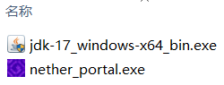
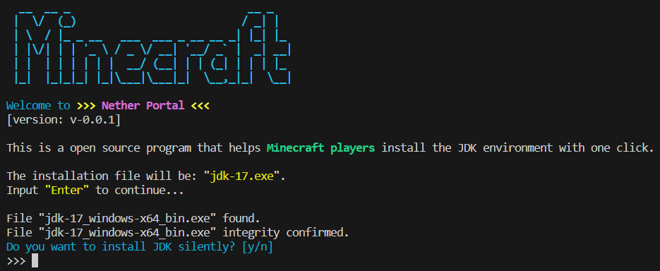
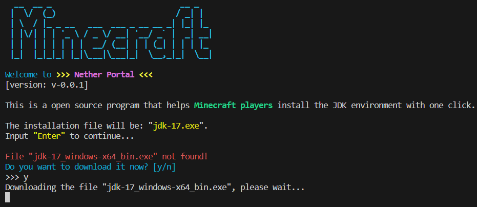
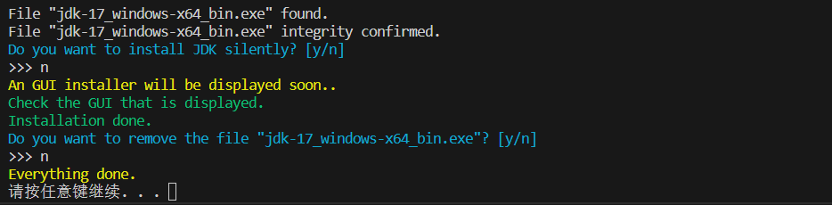
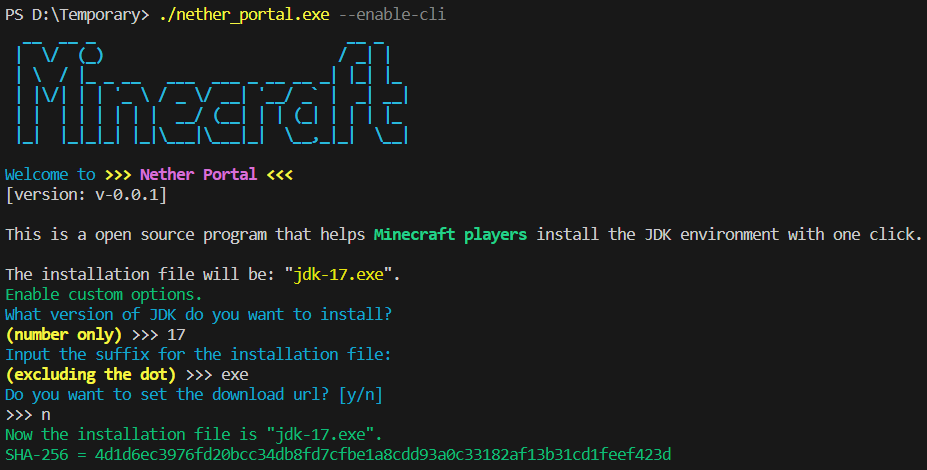
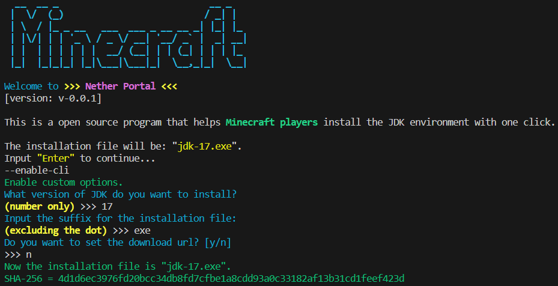

# Nether Portal - A JDK installation tool for MC Players

**Contents**  
- [Nether Portal - A JDK installation tool for MC Players](#nether-portal---a-jdk-installation-tool-for-mc-players)
  - [如何使用？](#如何使用)
    - [如果已经下载了 JDK](#如果已经下载了-jdk)
    - [如果还没有下载、也不知道怎么下载 JDK](#如果还没有下载也不知道怎么下载-jdk)
  - [命令行选项](#命令行选项)
  - [FAQ](#faq)
    - [Nether Portal 如何得知文件的完整性？](#nether-portal-如何得知文件的完整性)
    - [为什么不是 GUI 程序？](#为什么不是-gui-程序)
    - [我可以使用私有仓库作为 URL 下载源吗？](#我可以使用私有仓库作为-url-下载源吗)
    - [为什么 CLI 界面不是中文？](#为什么-cli-界面不是中文)

一个为初入 Minecraft 大门的玩家们准备的 JDK 安装工具.

Nether Portal 提供了命令行界面（CLI），用于下载 JDK 安装文件、验证 JDK 文件的完整性以及（可选的）JDK 静默安装选项. 

不需要使用额外的 Installer 安装这个工具.（开箱即用！）

[点击这里下载](https://github.com/Konvt/Nether-Portal/releases/download/v0.0.2/nether_portal.exe)

## 如何使用？
### 如果已经下载了 JDK
如果你已经从别的什么地方下载了一个 JDK 文件，那么你可以将 release 程序放在和 JDK 文件相同的文件夹中.

双击打开 nether_portal.exe 程序，然后你就能进入安装流程了.

当然，在实际安装前 Nether Portal 会校验 JDK 文件的完整性，所以请正确下载并保留 JDK 文件原始名称.
### 如果还没有下载、也不知道怎么下载 JDK
这个时候只需要在随便某个地方运行 Nether Portal，程序会自动检测并尝试从 download.oracle.com 下载一个 JDK.
（当前默认尝试下载 JDK-17）

下载时长通常取决于你的网络连接状态. 下载完成后 Nether Portal 会自动提示选择 GUI 界面安装还是使用静默安装.

> 在静默安装下，程序会自动调用下载好的 JDK 开始安装 java 环境，所有配置都会采用默认的 JDK 安装配置.

安装完成后，Nether Portal 会主动询问是否清除 JDK 文件，这个时候无论是直接退出程序、还是继续与程序交互都不会导致任何问题.

## 命令行选项
Nether Portal 还提供了一个额外但隐藏的命令行交互选项，可以用于指定安装的 JDK 版本、JDK 文件后缀以及更改 URL 下载源.

如果从命令行启动 exe 程序，只需要传入一个 `--enable-cli` 即可开启这个功能：

如果是双击 exe 程序启动，只需在程序等待回车时输入 `--enable-cli` 即可开启这个功能：

## FAQ
### Nether Portal 如何得知文件的完整性？
如果同目录下有一个 JDK 安装文件、但是没下载完或是传输时有损坏，Nether Portal 能够检测出这个文件不完整、并提示是否重新下载.

原理是 Nether Portal 在查询到存在 JDK 文件时，会尝试计算这个文件的 SHA-256 并与预设的值做对比，如果不一致显然这个文件与官方的安装文件存在差异.

因此在使用命令行选项时、更改 JDK 版本或更改 JDK 文件后缀都会导致程序索取一个新的 SHA-256 值用于校验文件完整性.
### 为什么不是 GUI 程序？
~~因为 GUI 写起来好麻烦（bushi~~

如果你很希望能够有一个 GUI 版本，你可以自己 fork 一个仓库，然后在 CLI 的基础上包装一个 CLI-to-GUI 的程序.
### 我可以使用私有仓库作为 URL 下载源吗？
当然，Nether Portal 的命令行选项就是为了支持这个而编写的.

你可以编写一个脚本文件实现使用 `--enable-cli` 参数启动 Nether Portal，并将所有必要参数传进去；这个程序是相当自由的（指遵循 MIT License）.
### 为什么 CLI 界面不是中文？
因为我不能保证所有人的命令行编码都是 UTF-8，与其做复杂的适配工作不如直接使用全英界面.
